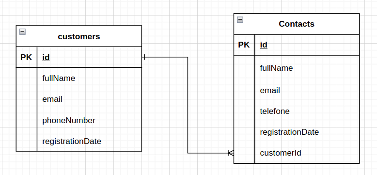

# Documentação da API

## Tabela de Conteúdos

- [Visão Geral](#1-visão-geral)
- [Diagrama ER](#2-diagrama-er)
- [Início Rápido](#3-início-rápido)
  - [Instalando Dependências](#31-instalando-dependências)
  - [Variáveis de Ambiente](#32-variáveis-de-ambiente)
  - [Migrations](#33-migrations)
  - [Iniciando](#34-iniciando)
- [Autenticação](#4-autenticação)
- [Endpoints](#5-endpoints)

---

## 1. Visão Geral

Visão geral do projeto, um pouco das tecnologias usadas.

- [NodeJS](https://nodejs.org/en/)
- [Express](https://expressjs.com/pt-br/)
- [TypeScript](https://www.typescriptlang.org/)
- [PostgreSQL](https://www.postgresql.org/)
- [TypeORM](https://typeorm.io/)
- [Yup](https://www.npmjs.com/package/yup)

A URL base da aplicação:
https://contacts-backend-bdwz.onrender.com

---

## 2. Diagrama ER

[ Voltar para o topo ](#tabela-de-conteúdos)

Diagrama ER da API definindo bem as relações entre as tabelas do banco de dados.



---

## 3. Início Rápido

[ Voltar para o topo ](#tabela-de-conteúdos)

### 3.1. Instalando Dependências

Clone o projeto em sua máquina e instale as dependências com o comando:

```shell
yarn
```

### 3.2. Variáveis de Ambiente

Em seguida, crie um arquivo **.env**, copiando o formato do arquivo **.env.example**.

Configure suas variáveis de ambiente com suas credenciais do Postgres e uma nova database da sua escolha.

### 3.3. Migrations

Execute as migrations com o comando:

```
yarn typeorm migration:run -d src/data-source.ts
```

### 3.4. Iniciando

Execute o comando para iniciar o api:

```
yarn dev
```

---

## 4. Autenticação

[ Voltar para o topo ](#tabela-de-conteúdos)

Por enquanto, não foi implementada autenticação.

---

## 5. Endpoints

[ Voltar para o topo ](#tabela-de-conteúdos)

### Índice

- [Customers](#1-customers)
  - [POST - /customers](#11-criação-de-cliente)
  - [GET - /customers](#12-listando-clientes)
  - [GET - /customers/:custumer_id](#13-listar-cliente-por-id)
  - [PATCH - /customers/:custumer_id](#14-atualizar-cliente-por-id)
  - [DELETE - /customers/:custumer_id](#15-delete-cliente-por-id)
- [Contacts](#2-contacts)
  - [POST - /contacts](#21-criação-de-contatos)
  - [GET - /contact](#22-listando-contatos)
  - [GET - /contact/:contact_id](#23-listar-contato-por-id)
  - [GET - /contact/customers/:custumer_id](#24-listar-contato-pelo-id-do-cliente)
  - [PATCH - /contact/:contact_id](#25-atualizar-contato-por-id)
  - [DELETE - /contact/:contact_id](#26-delete-contato-por-id)

---

## 1. **Customers**

[ Voltar para os Endpoints ](#5-endpoints)

O objeto User é definido como:

| Campo       | Tipo   | Descrição                          |
| ----------- | ------ | ---------------------------------- |
| id          | string | Identificador único do cliente     |
| fullName    | string | O nome completo do cliente.        |
| email       | string | O e-mail do cliente.               |
| phoneNumber | string | Número de telefone do cliente      |
| createdAt   | date   | Data que o cliente foi criado.     |
| updatedAt   | date   | Data que o cliente foi atualizado. |
| deletedAt   | date   | Data que o cliente foi excluido.   |

### Endpoints

| Método | Rota                    | Descrição                                                           |
| ------ | ----------------------- | ------------------------------------------------------------------- |
| POST   | /customers              | Criação de um cliente.                                              |
| GET    | /customers/             | Lista todos os clientes                                             |
| GET    | /customers/:customer_id | Lista um cliente usando seu ID como parâmetro                       |
| PATCH  | /customers/:customer_id | Atualizar as informações de um cliente usando seu ID como parâmetro |
| DELETE | /customers/:customer_id | Deletar um cliente usando seu ID como parâmetro                     |

---

### 1.1. **Criação de Cliente**

[ Voltar para os Endpoints ](#5-endpoints)

### `/customers`

### Exemplo de Request:

```
POST /customers
Host: https://contacts-backend-bdwz.onrender.com
Authorization: None
Content-type: application/json
```

### Corpo da Requisição:

```json
{
  "fullName": "Andressa",
  "email": "user3@user.com",
  "phoneNumber": "11999999999"
}
```

### Schema de Validação com Yup:

```javascript
yup.object().shape({
  id: yup.string(),
  fullName: yup.string().required('Nome é obrigatório'),
  email: yup
    .string()
    .email('Formato de email invalido')
    .required('Email é obrigatório'),
  phoneNumber: yup.string().required('Telefone é obrigatório'),
});
```

OBS.: Chaves não presentes no schema serão removidas.

### Exemplo de Response:

```
201 Created
```

```json
{
  "fullName": "Andressa",
  "email": "user3@user.com",
  "phoneNumber": "11999999999",
  "id": "60e8d302-5874-46c0-a3ae-b11285029641",
  "createdAt": "2023-03-31T23:55:33.712Z",
  "updatedAt": "2023-03-31T23:55:33.712Z",
  "deletedAt": null
}
```

### Possíveis Erros:

| Código do Erro            | Descrição                 |
| ------------------------- | ------------------------- |
| 409 Conflict              | Email already registered. |
| 505 Internal Server Error | Internal Server Error.    |

---

### 1.2. **Listando Clientes**

[ Voltar aos Endpoints ](#5-endpoints)

### `/customers`

### Exemplo de Request:

```
GET /customers
Host: https://contacts-backend-bdwz.onrender.com
Authorization: None
Content-type: application/json
```

### Corpo da Requisição:

```json
Vazio
```

### Exemplo de Response:

```
200 OK
```

```json
[
  {
    "fullName": "Andressa",
    "email": "user3@user.com",
    "phoneNumber": "11999999999",
    "id": "60e8d302-5874-46c0-a3ae-b11285029641",
    "createdAt": "2023-03-31T23:55:33.712Z",
    "updatedAt": "2023-03-31T23:55:33.712Z",
    "deletedAt": null
  }
]
```

### Possíveis Erros:

| Código do Erro            | Descrição              |
| ------------------------- | ---------------------- |
| 505 Internal Server Error | Internal Server Error. |

---

### 1.3. **Listar Cliente por ID**

[ Voltar aos Endpoints ](#5-endpoints)

### `/customers/:customer_id`

### Exemplo de Request:

```
GET /customers/:customer_id
Host: https://contacts-backend-bdwz.onrender.com
Authorization: None
Content-type: application/json
```

### Parâmetros da Requisição:

| Parâmetro   | Tipo   | Descrição                                 |
| ----------- | ------ | ----------------------------------------- |
| customer_id | string | Identificador único do cliente (Customer) |

### Corpo da Requisição:

```json
Vazio
```

### Exemplo de Response:

```
200 OK
```

```json
{
  "fullName": "Andressa",
  "email": "user3@user.com",
  "phoneNumber": "11999999999",
  "id": "60e8d302-5874-46c0-a3ae-b11285029641",
  "createdAt": "2023-03-31T23:55:33.712Z",
  "updatedAt": "2023-03-31T23:55:33.712Z",
  "deletedAt": null
}
```

### Possíveis Erros:

| Código do Erro            | Descrição              |
| ------------------------- | ---------------------- |
| 404 Not Found             | Customer not found.    |
| 505 Internal Server Error | Internal Server Error. |

### 1.4. **Atualizar Cliente por ID**

[ Voltar aos Endpoints ](#5-endpoints)

### `/customers/:customer_id`

### Exemplo de Request:

```
GET /customers/:customer_id
Host: https://contacts-backend-bdwz.onrender.com
Authorization: None
Content-type: application/json
```

### Parâmetros da Requisição:

| Parâmetro   | Tipo   | Descrição                                 |
| ----------- | ------ | ----------------------------------------- |
| customer_id | string | Identificador único do cliente (Customer) |

### Corpo da Requisição:

```json
{
  "fullName": "Andressa Lopes",
  "email": "teste@user.com"
}
```

### Exemplo de Response:

```
200 OK
```

```json
{
  "generatedMaps": [],
  "raw": [],
  "affected": 2
}
```

### Schema de Validação com Yup:

```javascript
yup.object().shape({
  fullName: yup.string(),
  email: yup.string().email('Formato de email invalido'),
  phoneNumber: yup.string(),
});
```

OBS.: Chaves não presentes no schema serão removidas.

### Possíveis Erros:

| Código do Erro            | Descrição              |
| ------------------------- | ---------------------- |
| 404 Not Found             | Customer not found.    |
| 505 Internal Server Error | Internal Server Error. |

### 1.5. **Deletar Cliente por ID**

[ Voltar aos Endpoints ](#5-endpoints)

### `/customers/:customer_id`

### Exemplo de Request:

```
DELETE /customers/:customer_id
Host: https://contacts-backend-bdwz.onrender.com
Authorization: None
Content-type: application/json
```

### Parâmetros da Requisição:

| Parâmetro   | Tipo   | Descrição                                 |
| ----------- | ------ | ----------------------------------------- |
| customer_id | string | Identificador único do cliente (Customer) |

### Corpo da Requisição:

```json
Vazio
```

### Exemplo de Response:

```
204 No Content
```

```json
Vazio
```

### Possíveis Erros:

| Código do Erro            | Descrição              |
| ------------------------- | ---------------------- |
| 404 Not Found             | Customer not found.    |
| 505 Internal Server Error | Internal Server Error. |

## 2. **Contacts**

[ Voltar para os Endpoints ](#5-endpoints)

O objeto User é definido como:

| Campo       | Tipo   | Descrição                          |
| ----------- | ------ | ---------------------------------- |
| id          | string | Identificador único do contato     |
| fullName    | string | O nome completo do contato.        |
| email       | string | O e-mail do contato.               |
| phoneNumber | string | Número de telefone do contato      |
| createdAt   | date   | Data que o contato foi criado.     |
| updatedAt   | date   | Data que o contato foi atualizado. |
| deletedAt   | date   | Data que o contato foi excluido.   |
| customerId  | string | Id do cliente(Customer).           |

### Endpoints

| Método | Rota                            | Descrição                                                           |
| ------ | ------------------------------- | ------------------------------------------------------------------- |
| POST   | /contacts                       | Criação de um contato.                                              |
| GET    | /contacts/                      | Lista todos os contatos                                             |
| GET    | /contacts/:contact_id           | Lista um contato usando seu ID como parâmetro                       |
| GET    | /contacts/custumer/:customer_id | Lista todos contatos do cliente com o id do cliente como parâmetro  |
| PATCH  | /contacts/:contact_id           | Atualizar as informações de um contato usando seu ID como parâmetro |
| DELETE | /contacts/:contact_id           | Deletar um contato usando seu ID como parâmetro                     |

---

---

### 2.1. **Criação de Contatos**

[ Voltar para os Endpoints ](#5-endpoints)

### `/contacts`

### Exemplo de Request:

```
POST /contacts
Host: https://contacts-backend-bdwz.onrender.com
Authorization: None
Content-type: application/json
```

### Corpo da Requisição:

```json
{
  "fullName": "Contatinho",
  "email": "contato@users.com",
  "phoneNumber": "11888888888",
  "customerId": "60e8d302-5874-46c0-a3ae-b11285029641"
}
```

### Schema de Validação com Yup:

```javascript
yup.object().shape({
  id: yup.string(),
  fullName: yup.string().required('Nome é obrigatório'),
  email: yup
    .string()
    .email('Formato de email invalido')
    .required('Email é obrigatório'),
  phoneNumber: yup.string().required('Telefone é obrigatório'),
  customerId: yup.string().required('custumerId é obrigatório'),
});
```

OBS.: Chaves não presentes no schema serão removidas.

### Exemplo de Response:

```
201 Created
```

```json
{
  "fullName": "Contatinhoo",
  "email": "contato@users.com",
  "phoneNumber": "11888888888",
  "customer": {
    "fullName": "Andressa",
    "email": "user3@user.com",
    "phoneNumber": "11999999999",
    "id": "60e8d302-5874-46c0-a3ae-b11285029641",
    "createdAt": "2023-03-31T23:55:33.712Z",
    "updatedAt": "2023-03-31T23:55:33.712Z",
    "deletedAt": null
  },
  "deletedAt": null,
  "id": "db6579fb-6fff-4653-827e-5fd2f3991669",
  "createdAt": "2023-04-05T18:40:53.263Z",
  "updatedAt": "2023-04-05T18:40:53.263Z"
}
```

### Possíveis Erros:

| Código do Erro            | Descrição              |
| ------------------------- | ---------------------- |
| 404 Not Found             | Customer not found.    |
| 409 Conflict              | Contact alredy exists. |
| 505 Internal Server Error | Internal Server Error. |

---

### 2.2. **Listando Contatos**

[ Voltar aos Endpoints ](#5-endpoints)

### `/contacts`

### Exemplo de Request:

```
GET /contacts
Host: https://contacts-backend-bdwz.onrender.com
Authorization: None
Content-type: application/json
```

### Corpo da Requisição:

```json
Vazio
```

### Exemplo de Response:

```
200 OK
```

```json
[
  {
    "fullName": "Contatinhoo",
    "email": "contato@users.com",
    "phoneNumber": "11888888888",
    "customer": {
      "fullName": "Andressa",
      "email": "user3@user.com",
      "phoneNumber": "11999999999",
      "id": "60e8d302-5874-46c0-a3ae-b11285029641",
      "createdAt": "2023-03-31T23:55:33.712Z",
      "updatedAt": "2023-03-31T23:55:33.712Z",
      "deletedAt": null
    },
    "deletedAt": null,
    "id": "db6579fb-6fff-4653-827e-5fd2f3991669",
    "createdAt": "2023-04-05T18:40:53.263Z",
    "updatedAt": "2023-04-05T18:40:53.263Z"
  }
]
```

### Possíveis Erros:

| Código do Erro            | Descrição              |
| ------------------------- | ---------------------- |
| 505 Internal Server Error | Internal Server Error. |

---

### 2.3. **Listar Cliente por ID**

[ Voltar aos Endpoints ](#5-endpoints)

### `/contact/:contact_id`

### Exemplo de Request:

```
GET /contact/:contact_id
Host: https://contacts-backend-bdwz.onrender.com
Authorization: None
Content-type: application/json
```

### Parâmetros da Requisição:

| Parâmetro  | Tipo   | Descrição                                |
| ---------- | ------ | ---------------------------------------- |
| contact_id | string | Identificador único do contato (Contact) |

### Corpo da Requisição:

```json
Vazio
```

### Exemplo de Response:

```
200 OK
```

```json
{
  "fullName": "Contatinhoo",
  "email": "contato@users.com",
  "phoneNumber": "11888888888",
  "customer": {
    "fullName": "Andressa",
    "email": "user3@user.com",
    "phoneNumber": "11999999999",
    "id": "60e8d302-5874-46c0-a3ae-b11285029641",
    "createdAt": "2023-03-31T23:55:33.712Z",
    "updatedAt": "2023-03-31T23:55:33.712Z",
    "deletedAt": null
  },
  "deletedAt": null,
  "id": "db6579fb-6fff-4653-827e-5fd2f3991669",
  "createdAt": "2023-04-05T18:40:53.263Z",
  "updatedAt": "2023-04-05T18:40:53.263Z"
}
```

### Possíveis Erros:

| Código do Erro            | Descrição              |
| ------------------------- | ---------------------- |
| 404 Not Found             | Contact not found.     |
| 505 Internal Server Error | Internal Server Error. |

---

### 2.4. **Listando Contatos Pelo Id do CLiente**

[ Voltar aos Endpoints ](#5-endpoints)

### `/contacts/custumer/:customer_id`

### Exemplo de Request:

```
GET /contacts/custumer/:customer_id
Host: https://contacts-backend-bdwz.onrender.com
Authorization: None
Content-type: application/json
```

### Parâmetros da Requisição:

| Parâmetro   | Tipo   | Descrição                                 |
| ----------- | ------ | ----------------------------------------- |
| customer_id | string | Identificador único do cliente (Customer) |

### Corpo da Requisição:

```json
Vazio
```

### Exemplo de Response:

```
200 OK
```

```json
[
  {
    "fullName": "Contatinhoo",
    "email": "contato@users.com",
    "phoneNumber": "11888888888",
    "customer": {
      "fullName": "Andressa",
      "email": "user3@user.com",
      "phoneNumber": "11999999999",
      "id": "60e8d302-5874-46c0-a3ae-b11285029641",
      "createdAt": "2023-03-31T23:55:33.712Z",
      "updatedAt": "2023-03-31T23:55:33.712Z",
      "deletedAt": null
    },
    "deletedAt": null,
    "id": "db6579fb-6fff-4653-827e-5fd2f3991669",
    "createdAt": "2023-04-05T18:40:53.263Z",
    "updatedAt": "2023-04-05T18:40:53.263Z"
  }
]
```

### Possíveis Erros:

| Código do Erro            | Descrição              |
| ------------------------- | ---------------------- |
| 404 Not Found             | Customer not found.    |
| 505 Internal Server Error | Internal Server Error. |

---

### 2.5. **Atualizar Contato por ID**

[ Voltar aos Endpoints ](#5-endpoints)

### `/contacts/:contact_id`

### Exemplo de Request:

```
PATCH /contacts/:contact_id
Host: https://contacts-backend-bdwz.onrender.com
Authorization: None
Content-type: application/json
```

### Parâmetros da Requisição:

| Parâmetro  | Tipo   | Descrição                                |
| ---------- | ------ | ---------------------------------------- |
| contact_id | string | Identificador único do contato (Contact) |

### Corpo da Requisição:

```json
{
  {
    "fullName": "Contatão",
  }
}
```

### Exemplo de Response:

```
200 OK
```

```json
{
  "generatedMaps": [],
  "raw": [],
  "affected": 1
}
```

### Schema de Validação com Yup:

```javascript
yup.object().shape({
  fullName: yup.string(),
  email: yup.string().email('Formato de email invalido'),
  phoneNumber: yup.string(),
});
```

OBS.: Chaves não presentes no schema serão removidas.

### Possíveis Erros:

| Código do Erro            | Descrição              |
| ------------------------- | ---------------------- |
| 404 Not Found             | Contact not found.     |
| 505 Internal Server Error | Internal Server Error. |

### 1.5. **Deletar Contato por ID**

[ Voltar aos Endpoints ](#5-endpoints)

### `/contacts/:contact_id`

### Exemplo de Request:

```
DELETE /contacts/:contact_id
Host: https://contacts-backend-bdwz.onrender.com
Authorization: None
Content-type: application/json
```

### Parâmetros da Requisição:

| Parâmetro  | Tipo   | Descrição                                |
| ---------- | ------ | ---------------------------------------- |
| contact_id | string | Identificador único do contato (Contact) |

### Corpo da Requisição:

```json
Vazio
```

### Exemplo de Response:

```
204 No Content
```

### Possíveis Erros:

| Código do Erro            | Descrição              |
| ------------------------- | ---------------------- |
| 404 Not Found             | Contact not found.     |
| 505 Internal Server Error | Internal Server Error. |
